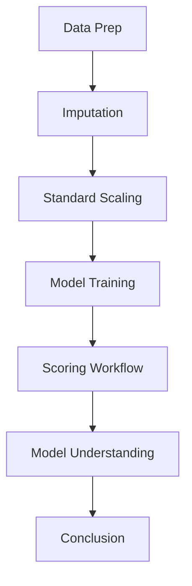
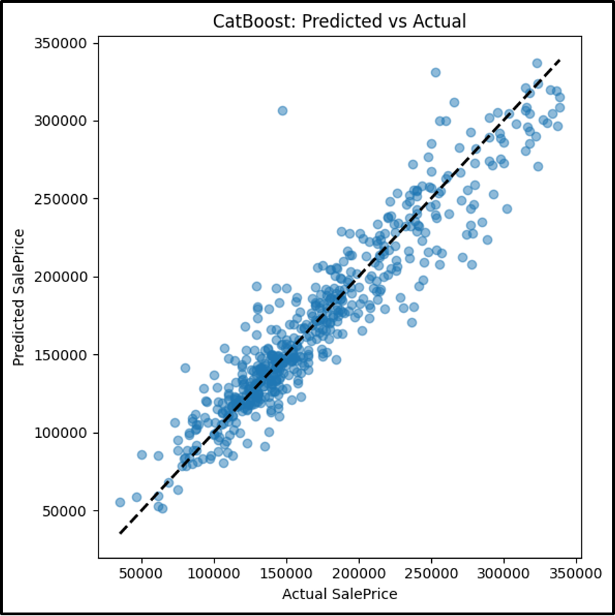

# Catboost Model

## Analytic Approach

- Target variable: **SalePrice** (the sale price of homes)
- A mixture of raw and engineered features, including living area, basement area, overall quality, age/remodel metrics, various quality×size interaction terms, garage attributes, bathroom counts, and encoded categorical variables (e.g. FireplaceQu_Ord, KitchenQual_Ord, ExterQual_Ord).

## Model Description

CatBoost is a gradient boosting library that uses a combination of decision trees to make predictions. It is a popular choice for many ML competitions and is known for its high performance and accuracy. Here's how it works:

1. **Boosting**: CatBoost uses a technique called gradient boosting, where each new tree is trained to correct the errors of the previous trees. This helps the model learn complex patterns in the data.
2. **Regularization**: It uses regularization techniques to prevent overfitting and improve generalization.
3. **Parallel Processing**: It can take advantage of multiple CPU cores to speed up training.



- First it fills its missing values filled with column‐wise means via SimpleImputer.
- CatBoost trains directly on the imputed training set, handling numeric features natively.
- The trained model outputs continuous sale‐price predictions on the test set.
- CatBoostRegressor learner from the catboost package, chosen for its strong handling of categorical encodings, automatic feature interactions, and robust regularization.
- Learner hyper-parameters:

```python
"CatBoost": CatBoostRegressor(
    iterations=400,
    learning_rate=0.05,
    depth=6,
    loss_function='RMSE',
    verbose=False,
    random_state=42
)
```

## Results (Model Performance)

Model Performance Comparison Charts for Catboost’s model



## Model Understanding

This scatter plot of the CatBoost model’s predicted sale prices vs. the true sale prices for the hold‑out test set. The dashed line shows perfect prediction, points lying directly on that line would mean the model predicted the sale price exactly. The tight cluster of points around the line tells us that, overall, the model’s predictions track the real values closely, with only a modest scatter indicating prediction error.

The bar chart of the 2-summary metrics for the same test set: R² which shows the proportion of variance in sale price explained by the model and the MAPE which measures the average absolute prediction error as a percentage of the true price. A high R² bar (near 1.0) means a strong overall fit. Most of the variance in sale price is captured while a low MAPE indicates that, on average, the models' predictions deviate from the actual price by less than 10%.

## Conclusion and Discussions for Next Steps

- The top predictors were OverallQual, GrLivArea, KitchenQual_Ord, TotalBsmtSF
- _QualityxSize_ terms helped explain non-linear relationships on price
- Other features to consider are features that were out of the dataset like crime factor/rating, aggregating neighborhood sale price
- Relevant data sources that are available are school ratings, economic factors including interest rates and unemployment.
