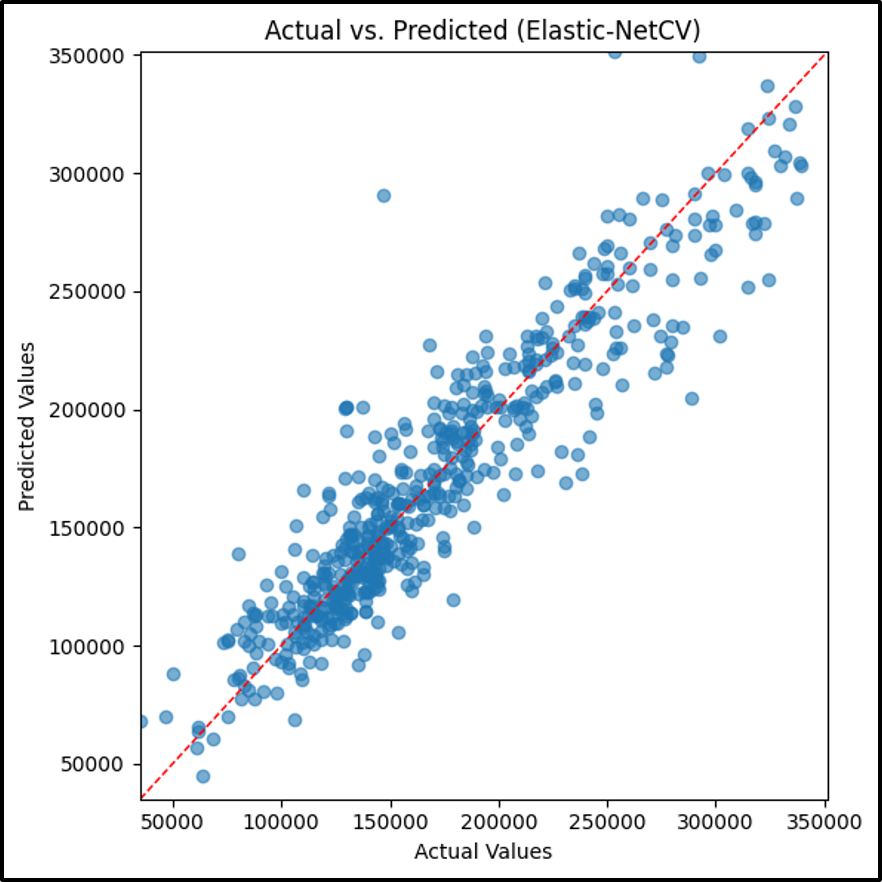

# Elastic-NetCV Model

## Analytic Approach

* Target variable: **SalePrice** (the sale price of homes)
* All 30 property level features like OverallQual, GrLivArea, YearBuilt and others. Missing values are imputed, and numerical features are standardized via preprocessing pipeline.
* A Regularized linear regression model that uses both lasso and ridge penalties to control complexity, and it automatically tunes how much of each penalty to apply by testing many options with cross-validation.

## Model Description

* Models and Parameters
    * sk.learn.linear_model.ElasticNetCV inside a sklearn.Pipeline (imputer + scaler + ElasticNetCV) learner was used

* Hyper-parameters:
    * alphas=np.logspace(-3, 2, 50) which generates 50 candidate penalty strength evenly spaced on a log scale. ElasticNetCV tries each of these 50 values to see which gives out the best held out performance
    * l1_ratio=[0.1, 0.5, 0.9] specifies 3 candidate mixes between lasso and ridge penalties. This lets the model pick whether it wants to be sparser with a high L1 or smoother with high L2.
    * Cv=5, uses 5-fold cross validation on the training set.
    * Tol=1e-3 is for stopping tolerance for optimizing the algorithm, when the change in the objective function between iterations fall below 0.001, training stops.
    * Max_iter=50000 for the max number of coordinate-descent iterations allowed.

## Results (Model Performance)

**Elastic-NetCV Model Results**

With an `RSME` $23,147 and `R²` of 0.855, this graph shows the large deviations in mid to high price ranges which highlight its inability to capture nonlinearity.

## Model Understanding

Nonzero coefficients concentrate on `OverallQual`, `GrLivArea`, and `YearBuilt` while other features are heavily shrunk toward zero. A linear model confirms that quality, size and age the dominant linear drivers but misses more subtle interactions captured by tree-based learners.

## Conclusion and Discussions for Next Steps

Elastic-NetCV offers easier interpretability but at the cost of higher error where `RSME` is 20% worse than the best tree-based models. Low complexity minimizes over-fit, but residuals indicate under-fitting on complex patterns. Polynomial terms or piecewise transformations of top predictors could bridge that gap. Socioeconomic indicators may enrich the linear model.
