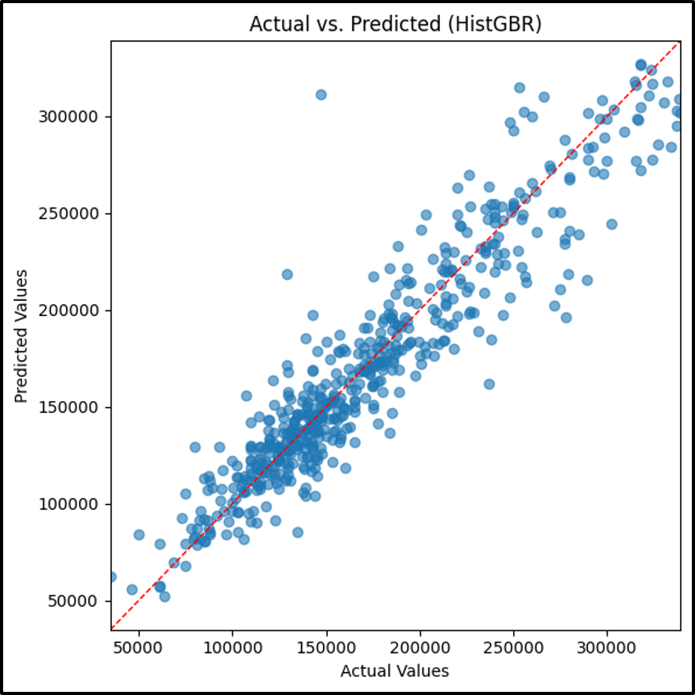

# HistGBR Model

## Analytic Approach

* Target variable: **SalePrice** (the sale price of homes)
* All 30 property level features like OverallQual, GrLivArea, YearBuilt and others. Missing values are imputed, and numerical features are standardized via preprocessing pipeline.
* A Gradient-boosted decision tree implemented via HistGradientBoostingRegressor

## Model Description

* Models and Parameters
    * The full feature matrix  X and target vector y are defined. 
    * Data is partitioned into training (X_train, y_train) and test sets (X_test, y_test) via train_test_split. All numeric predictors flow through a SimpleImputer (e.g. median strategy), which fills in any NaNs.
    * A sklearn.HistGradientBoostingRegressor wrapped in a preprocessing pipeline.

* Hyper-parameters
    * max_iter=400
    * learning_rate=0.05
    * max_depth=None (full depth)
    * random_state=42

## Results

**HistGBR Model Results**

## Model Understanding

Top features by histogram‑based gain are `OverallQual`, `GrLivArea`, `YearBuilt`, and `TotalBsmtSF`.

The model captures nonlinear interactions among home quality, living area, and property age, producing tighter fits than linear methods but without the extra complexity of stacking.

## Conclusion and Discussions for Next Steps

HistGBR delivers near‑ensemble accuracy at lower training cost, its `RMSE` ($21,489) and `R²` (0.877) sit just behind XGBoost. The train vs. test gaps are minimal but learning-curve analysis would confirm no subtle over fit.

To further enhance model fidelity, we can engineer additional predictors such as rooms‑per‑square‑foot ratios or age‑adjusted condition scores. Moreover, enriching the dataset with external sources—school district ratings, local economic indicators (interest rates, unemployment), and neighborhood crime or walkability metrics could help close the small performance gap and better capture the drivers of high‑end property values.
