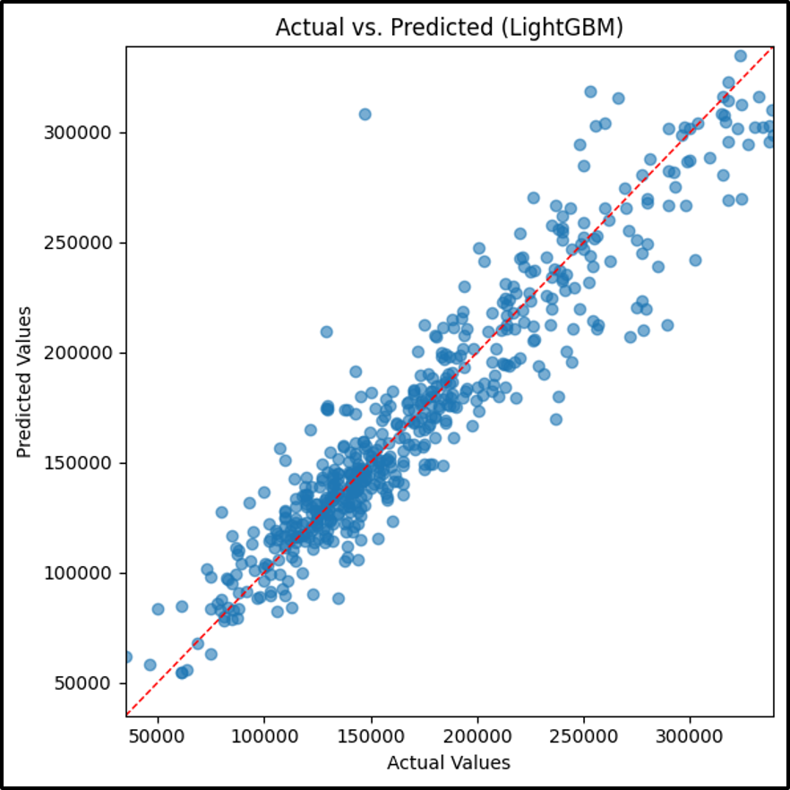

# LightGBM Model

## Analytic Approach

* Target variable: **SalePrice** (the sale price of homes)
* All 30 property level features like OverallQual, GrLivArea, YearBuilt and others. Missing values are imputed and numerical features are standardized via preprocessing pipeline.
* A Gradient boosted decision tree regressor model was made

## Model Understanding

The lightgbm.LGBMRegressor wrapped in a sklearn.Pipeline with imputation

* Hyper parameters:
    * n_estimators=400
    * learning_rate=0.05
    * max_depth=4
    * subsample=0.8
    * colsample_bytree=0.8

## Results

**LightGBM Model Results**

Top 5 features by histogram-based gain are `OverallQual`, `GrLivArea`, `YearBuilt`, `TotalBsmtSF`, and `Neighborhood indicators`.

Home quality and living area dominate price prediction in this model confirming domain intuition. Lesser importance on cosmetic variables like `LotShape` suggesting possible simplification.

## Conclusion and Discussions for Next Steps

The LightGBM regressor delivers strong predictive performance—achieving an `R²` of approximately 0.87 and an `RMSE` of about $20,820, which places it just behind the stacking ensemble and CatBoost models. 

This middle ranking reflects LightGBM’s efficiency and ability to model complex feature interactions, even though the other ensembles slightly outperform it on error minimization.

To further enhance model fidelity, we can engineer additional predictors such as rooms‑per‑square‑foot ratios or age‑adjusted condition scores. Moreover, enriching the dataset with external sources—school district ratings, local economic indicators (interest rates, unemployment), and neighborhood crime or walkability metrics could help close the small performance gap and better capture the drivers of high‑end property values.
