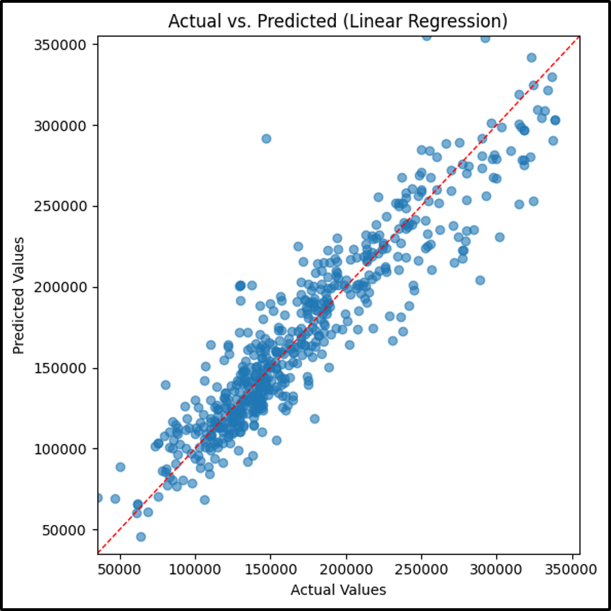

# Linear Regression Model

## Analytic Approach

- Target variable: **SalePrice** (the sale price of homes)
- All 30 property level features like OverallQual, GrLivArea, YearBuilt and others. Missing values are imputed, and numerical features are standardized via preprocessing pipeline.
- A model with ordinary least squares linear regression

## Model Description

- Models and Parameters: `Sklearn.linear_model.LinearRegression` wrapped with imputation in a pipeline
- Default hyper-parameters were used

## Results (Model Performance)

**Linear Regression Model Results**

## Model Understanding

The ordinary least squares model assigns its largest coefficients to important predictors like `OverallQual`, `GrLivArea` and `YearBuilt`, highlighting their direct linear influence on the sale price.

Most points lie near the y=x for mid-range values but dispersion widens at the price extremes, revealing the models inability to capture nonlinear thresholds and complex feature interactions.

With an `R²` of 0.856 and an `RMSE` of $23,276 (MAPE ~10.7%), the linear regression explains a substantial portion of variance yet underperforms relative to tree-based learners.

This underfitting indicates that introducing interaction terms and polynomial features could help the model reduce residual error and better mirror the underlying nonlinear structure in the data.

## Conclusion and Discussions for Next Steps

The ordinary least squares regression shows a clear interpretable baseline, capturing roughly 85.6% of the variance with an `RSME` of $23,276 but it underfits relative to more flexible, tree-based learners and shows widening errors at the high and low ends of the price spectrum.

Overfitting is not a concern here given the models simplicity. Instead, the primary concern is its inability to model nonlinear interactions. To improve fit, we can generate new features such as interaction terms, polynomial transforms like squared or cubic terms for area and age, and density metrics.

Beyond the current data, incorporating external indicators like socioeconomic factors should enrich the feature space and help the model better capture the complex drivers.
