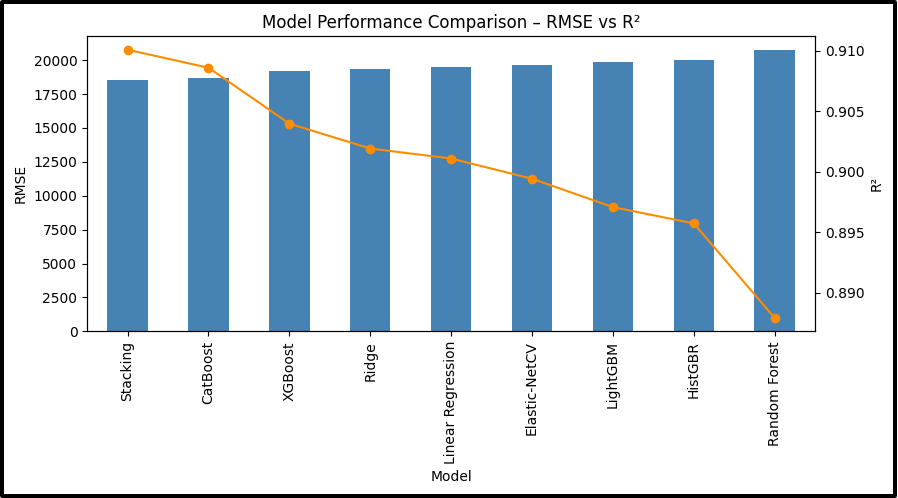
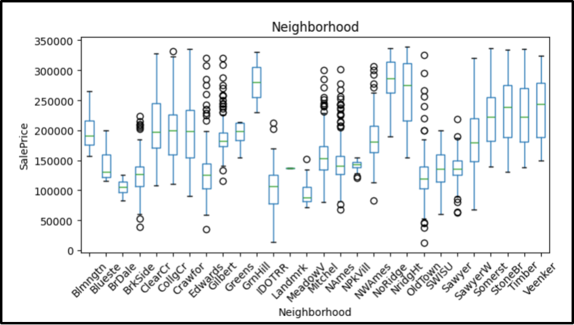
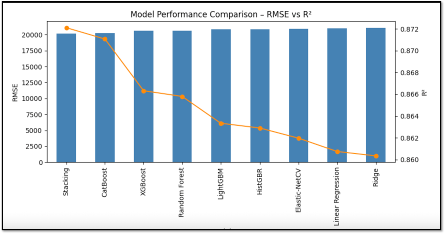

# Model Reports

The next section presents a comparison of all models that have been iteratively evaluated, along with an explanation for how each of the models were chosen. The team also chose a final feature set that streamlines the user facing implementation by abstracting complexities around neighborhoods, exterior finishes, roof styles, and more.

The following chart evaluates all features that have been ordinally mapped or one-hot encoded from the output of project deliverable 1.

**Figure 1**

Model Performance Comparison Graph Across All 9 Evaluated Models with All 107 Features

The results in Figure 1 represent 107 distinct features being evaluated across 9 common models. There are significant implementation challenges and concerns when presenting this many features in a production application. To begin, (need to list the challenges).

To trim the number of features available in the final models, we reviewed the feature importances in the initially evaluated model, Random Forest Regressor. Feature importances are an essential calculation in data science and machine learning, and represents how the model’s impurity decreases with the inclusion of an evaluated feature ([source](https://www.geeksforgeeks.org/machine-learning/feature-importance-with-random-forests/)). We also discussed both common inputs that are generally available in online real estate calculators, as well as the features that have been requested by A Home Valuing Company’s clients. The full list of features, feature types, and feature importances can be found in the[ data dictionary](https://docs.google.com/spreadsheets/d/1zRmdRlc2efk0RiQ3xv9OARQlnGgF3sbfwbhnpNbcv7Y/edit?gid=1249451046#gid=1249451046). One of the most glaring initial observations was how little influence neighborhoods had on a home’s sale price, even though there was clear separation in the dataset’s medians and IQRs as seen in Figure 2.

**Figure 2**

Neighborhood Box Plot from Project Deliverable 1

In total, the one-hot encoded neighborhoods accounted for a collective 1% importance factor in the Random Forest Regressor model. Upon further analysis, neighborhoods in the Ames dataset are an amalgamation of their home’s features. In other words, many of the other features - such as year built, overall quality, and garage finishings – are already “priced in,” resulting in little benefit with their inclusion in the final model. While 19 one-hot encoded neighborhood features made it to the data modeling phase based on their statistical significance calculated in notebook 1, trimming all results in a much cleaner, generalized, and user-friendly model that doesn’t sacrifice quality.

In fact, nearly all one-hot encoded features were not entirely significant in terms of the regressor model’s feature importance calculation. Again, many of these features are already explained by other, more impactful features. For example, a poured concrete foundation is more likely to have a higher ordinally mapped exterior quality and overall quality than a home with a slab foundation.

In the end, the team was able to reduce the feature count by 75% to 27 features, while still maintaining a very respectable RMSE and R2 metrics. This significantly reduced the complexity of the final model, as well as the processing time for the user facing web application.

**Figure 3**

Model Performance Comparison Graph Across All 9 Evaluated Models with Final 29 Features

The final Data Frame prepped for model evaluation had 30 total features, which can be found in the[ data dictionary](https://docs.google.com/spreadsheets/d/1zRmdRlc2efk0RiQ3xv9OARQlnGgF3sbfwbhnpNbcv7Y/edit?gid=555263764#gid=555263764).

| Feature                                                 | Feature Type | Raw User Input | RandomForest Regressor Feature Importance |
| ------------------------------------------------------- | ------------ | -------------- | -------------------------------------------- |
| (Qual x SF Plus Garage) + (Garage Finish x Garage Area) | Engineered   | FALSE          | 0.746573274                                  |
| Qual x SF Plus Garage                                   | Engineered   | FALSE          | 0.07490927384                                |
| Qual x SF                                               | Engineered   | FALSE          | 0.01216088569                                |
| Remodel Age                                             | Engineered   | FALSE          | 0.01170308916                                |
| Gr Liv Area                                             | Raw          | TRUE           | 0.01021667229                                |
| Year Remod/Add                                          | Raw          | TRUE           | 0.009475487271                               |
| Total Bsmt SF                                           | Raw          | TRUE           | 0.008376916287                               |
| Total SF Plus Garage                                    | Engineered   | FALSE          | 0.008273243131                               |
| Garage Yr Blt                                           | Raw          | TRUE           | 0.006890500739                               |
| House Age                                               | Engineered   | FALSE          | 0.006251766493                               |
| Total SF                                                | Engineered   | FALSE          | 0.005886440528                               |
| 1st Flr SF                                              | Raw          | TRUE           | 0.00585227365                                |
| Fireplace Qu_Ord                                        | Encoded      | TRUE           | 0.005527822946                               |
| Year Built                                              | Raw          | TRUE           | 0.005293349685                               |
| Kitchen Qual_Ord                                        | Encoded      | TRUE           | 0.005202609903                               |
| Garage Finish x Garage Area                             | Engineered   | FALSE          | 0.003886328288                               |
| Garage Finish x Garage Area x Garage Cars               | Engineered   | FALSE          | 0.003714796372                               |
| Garage Cars x Garage Area                               | Engineered   | FALSE          | 0.003494794465                               |
| Bsmt Qual_Ord                                           | Encoded      | TRUE           | 0.003331023943                               |
| Garage Area                                             | Raw          | FALSE          | 0.003090706467                               |
| Heating QC_Ord                                          | Encoded      | TRUE           | 0.002581292113                               |
| Total Baths                                             | Engineered   | FALSE          | 0.002484430229                               |
| Overall Qual                                            | Raw          | TRUE           | 0.001055998173                               |
| Full Bath                                               | Raw          | TRUE           | 0.0009679173451                              |
| Garage Finish x Garage Cars                             | Engineered   | FALSE          | 0.0008335035559                              |
| Exter Qual_Ord                                          | Encoded      | TRUE           | 0.000710615399                               |
| Garage Finish_Ord                                       | Encoded      | TRUE           | 0.0006992030566                              |
| House Style\_\_2Story                                   | Encoded      | FALSE          | 0.0003994213446                              |
| Garage Cars                                             | Raw          | TRUE           | 0.0003849920639                              |
