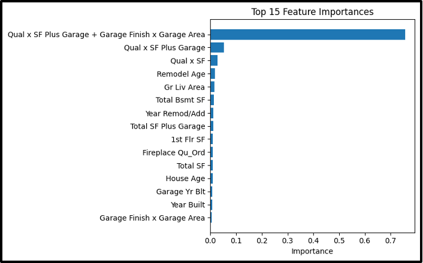

# Random Forest Regressor Model

_A RandomForestRegressor was chosen because it can capture complex and non-liner relationships and interactions between different features, and it has a built-in estimation of feature importance._

## Analytic Approach

- Target Variable: **SalePrice** (the final sale price of residential properties)
- Final feature set (30 predictors) from original house characteristics and engineered features including:
  - Quality-area (Qual x SF Plus Garage + Garage Finish x Garage Area, etc.)
  - Size measures (Gr Liv Area, Total SF, 1st Flr SF, Total Bsmt SF)
  - Age measures (House Age, Remodel Age, Year Remod/Add, Year Built, Garage Yr Blt)
  - Categorical Encodings (Fireplace Qu_Ord, Kitchen Qual_Ord, Bsmt Qual_Ord, Exter Qual_Ord, Heating QC_Ord, Garage Finish_Ord, House Style\_\_2Story)
  - Garage attributes and interactions (Garage Area, Garage Cars, Garage Finish x Garage Cars, Garage Finish x Garage Area x Garage Cars, Garage Cars x Garage Area)
  - Bathroom Counts (Full Bath, Total Baths)
  - Overall quality score (Overall Qual)
  - Temporal features (SaleYear, SaleMonth)

## Model Description

- Data Prep

  - Used Subset original DataFrame to the chosen 30 Features
  - Drop any rows with missing values and ‘Price per SF’ & ‘SalePrice’
  - Split 80% into training and 20% into testing

- Model Training

- Fit Random Forest on training data (rf.fit(X_train, y_train))

- Scoring Workflow:

  - Predict on hold-out test set (rf.predict(X_test)) then calculate performance metrics
  - Export feature importances to a csv file (feature_importances.csv)

- Hyper-parameters:
  - n_estimators=400 (# of trees)
  - max_depth=20 (max depth/tree)
  - min_samples_leaf=1 (minimum samples per leaf node)
  - random_state=42 (for reproducibility)
  - n_jobs=-1 (for parallel execution)

## Results (Model Performance)

- Test RSME: **20,632**
- An average prediction error of $20,600 is reasonable relative to typical home prices in the dataset
- Test R²: **0.866**

## Model Understanding

30 Features and their importance

| Feature                                             | Feature Importance |
| --------------------------------------------------- | ------------------ |
| Qual x SF Plus Garage + Garage Finish x Garage Area | 0.756185           |
| Qual x SF Plus Garage                               | 0.05328            |
| Qual x SF                                           | 0.027658           |
| Remodel Age                                         | 0.01694            |
| Gr Liv Area                                         | 0.015638           |
| Total Bsmt SF                                       | 0.013212           |
| Year Remod/Add                                      | 0.011873           |
| Total SF Plus Garage                                | 0.010398           |
| 1st Flr SF                                          | 0.010283           |
| Fireplace Qu_Ord                                    | 0.008816           |
| Total SF                                            | 0.008524           |
| House Age                                           | 0.008327           |
| Garage Yr Blt                                       | 0.007593           |
| Year Built                                          | 0.006982           |
| Garage Finish x Garage Area                         | 0.005946           |
| Garage Finish x Garage Area x Garage Cars           | 0.005513           |
| Garage Cars x Garage Area                           | 0.004557           |
| Garage Area                                         | 0.004259           |
| Kitchen Qual_Ord                                    | 0.004121           |
| Overall Qual                                        | 0.003995           |
| Bsmt Qual_Ord                                       | 0.003578           |
| Heating QC_Ord                                      | 0.003282           |
| Total Baths                                         | 0.003144           |
| Exter Qual_Ord                                      | 0.001378           |
| Garage Finish x Garage Cars                         | 0.001153           |
| Full Bath                                           | 0.001146           |
| House Style\_\_2Story                               | 0.001124           |
| Garage Finish_Ord                                   | 0.00081            |
| Garage Cars                                         | 0.000284           |

**Importance by features for Random Forest Regressor**

Composite features that combine overall quality and area (especially garage-related) influence predictive power the most. This highlights the premium that buyers place on high-quality, spacious homes with well-finished garages.

Living area and basement size are next in feature importance, as expected in the price modeling. Age and remodel timing features show that recently updated or newer homes sell at a higher price.

Secondary factors like fireplace quality, total bathrooms and kitchen/basement quality scores affect sale price but to a lesser extent. Rarely used features like Full Bath, House Style\_\_2Story, Garage Cars have minimal importance suggesting that we can remove them from future features.

## Conclusion and Discussions for Next Steps

The Random Forest model achieves strong predictive performance `R² = 0.866` on held-out data, with clear interpretability via feature importances. Composite interaction terms between quality and area are the key drivers of sale predictions. Training vs. Test performances was monitored and no severe overfitting observed given close alignment of cross-validation and test `RSME/ R²` during tuning. Parameters like `max_depth` and `min_samples_leaf` setting were chosen to balance depth and generalization. Next steps would include exploring additional interactions with other features like neighborhood x quality and polynomial terms. Additionally packaging this model into the production pipeline and implementing ongoing monitoring for data drift and set up model retraining triggers.
