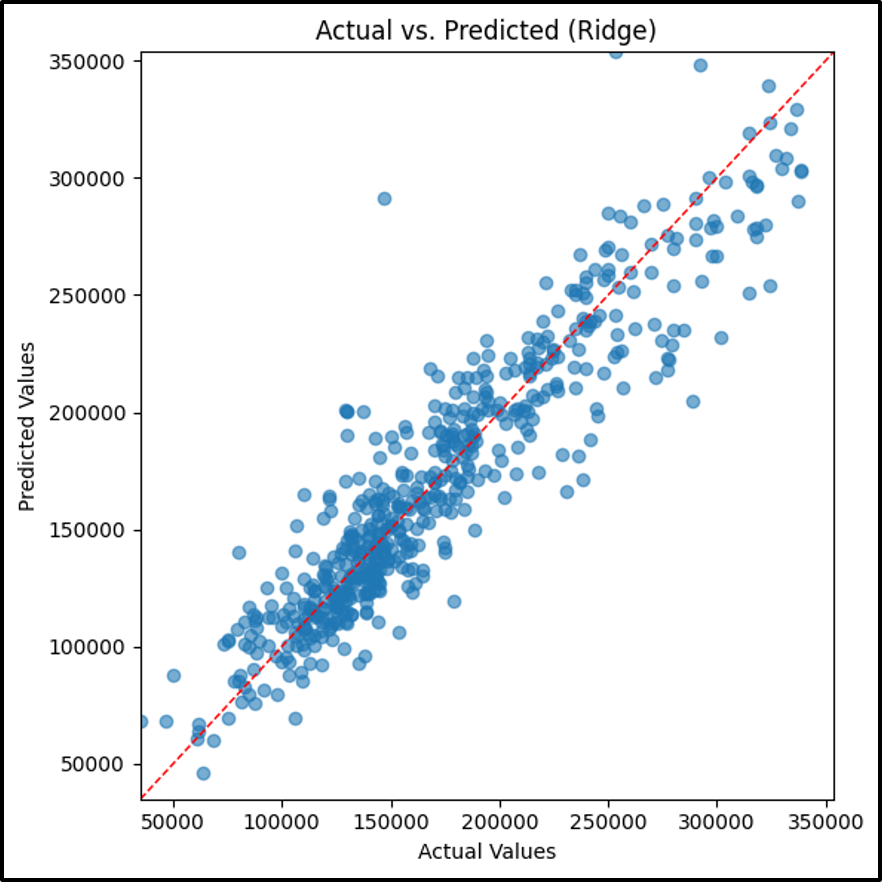

# Ridge Model

## Analytic Approach

- Target variable: **SalePrice** (the sale price of homes)
- All 30 property level features like OverallQual, GrLivArea, YearBuilt and others. Missing values are imputed, and numerical features are standardized via preprocessing pipeline.
- A model that uses L2-regularized linear regression

## Model Description

- Models and Parameters

  - `Sklearn.linear_model.Ridge(alpha=10)` inside an imputation pipeline

- Hyper-parameters:
  - Alpha=10 chosen to balance bias-variance

## Results (Model Performance)

**Ridge Model Results**

## Model Understanding

The Ridge regression model performed decent with an `RSME` of $21,407 and capturing 86% of the variance.

Its diagnostic residual plot shows a decline over ordinary least squares meaning errors are slightly increasing and there remains substantial spread in more complex price segments, indicating under-fitting where nonlinear relationships dominate.

From a model understanding standpoint, the L2 penalty effectively dampens noisy predictors, saving the strongest signals from features like `OverallQual` and `GrLivArea` while shrinking less informative coefficients toward zero.

## Conclusion and Discussions for Next Steps

The ridge regressor models’ performance ranks one of the lowest out of all the other models with a higher `RSME` and `R²` around 0.86. This is because it lags behind tree-based and ensemble methods because its strictly linear framework even with L2 regularization, it cannot capture the complex nonlinear relationships and higher order interactions inherent in housing data.

While it benefits from reduced variance, the models bias remains high leading to larger errors in mid and high price segments where feature effects are not purely additive or proportional.

Overfitting is not a concern for the Ridge model since the strong penalty (alpha=10) effectively prevents coefficients from becoming too large, resulting in similar train and test errors. However, this shrinkage trades off flexibility, causing under-fitting rather than over-fitting. Indicating that a purely linear hypothesis space is too restrictive for the problem at hand.

Beyond the current data, incorporating external indicators like socioeconomic factors should enrich the feature space and help the model better capture the complex drivers.
