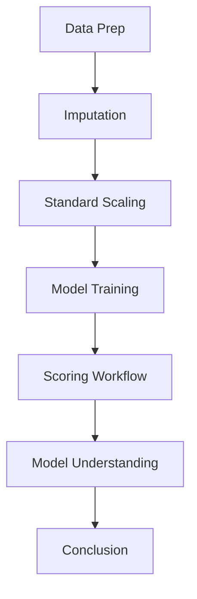
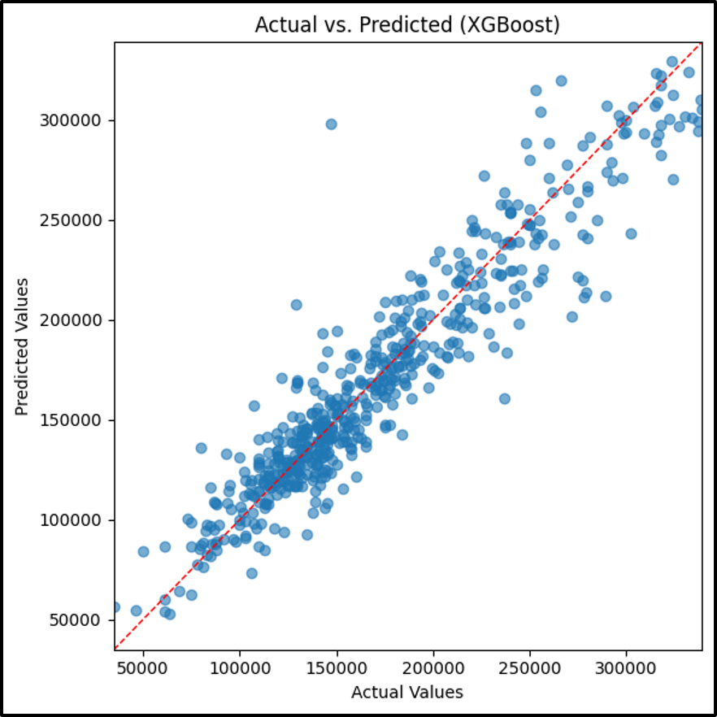

# XGBoost Model

## Background

The XGBoost model is a gradient boosted decision tree regressor that is a powerful and flexible machine learning algorithm. It is a type of ensemble learning method that combines multiple decision trees to create a more accurate and robust model. It is a popular choice for many ML competitions and is known for its high performance and accuracy. Here's how it works:

1. **Boosting**: XGBoost uses a technique called gradient boosting, where each new tree is trained to correct the errors of the previous trees. This helps the model learn complex patterns in the data.
2. **Regularization**: It uses regularization techniques to prevent overfitting and improve generalization.
3. **Parallel Processing**: It can take advantage of multiple CPU cores to speed up training.

## Analytic Approach

* Target variable: **SalePrice** (the sale price of homes)
* Inputs:
    * Numeric features: GrLivArea, TotalBsmtSF, age/remodel metrics, bathroom counts, etc.
    * Engineered features: Quality x Size interactions, overall condition indices, temporal metrics like year built and sale year
    * Encoded categorical: Ordinal for features like FireplaceQu, KitchenQual, ExterQual.

## Model Description

Data Flow



* First it fills its missing values filled with column‐wise means via SimpleImputer(strategy==’mean’).
* XBGRegressor is trained on the imputed dataset
* The fitted model outputs continuous sale-price predictions on the 20% hold out test set.


## Learners and Hyperparameters

```python
XGBRegressor(
    n_estimators=400,
    learning_rate=0.05,
    max_depth=4,
    subsample=0.8,
    colsample_bytree=0.8,
    random_state=42,
    n_jobs=-1)
```
## Results (Model Performance)



## Model Understanding

XGBoost’s built-in feature-gain metric identified OverallQual, GrLivArea and YearBuilt as the top drivers of sale price, with Neighborhood and TotalBsmtSF also ranking highly. These variables account for most of the model’s predictive power, confirming that home quality, living area, and property age

The close clustering of points around the y=x line in the Actual vs. Predicted indicates that XGBoost captures the dominant linear and non-linear relationships in the data very well. However, a slight over and under prediction at the extreme high-end prices suggests that ultra-premium properties exhibit additional complexity, maybe due to unique amenities or bespoke features that the current feature set doesn’t fully capture.


## Conclusion and Discussions for Next Steps

XGBoost is 3<sup>rd</sup> on the list with RSME ($20,592 and R² = 0.866. This is shown on the Actual cs Predicted plot, where the model shows a close fit of the y = x trendline but there are a few outliers.

The narrow performance gap between Stacking, CatBoost and XGBoost for the R² values suggests the models may be nearing the limit of what the current feature set can explain. Comparing train vs. test errors and inspecting the learning curves would ensure the stacking ensembles isn’t subtly over-fitting its meta-learner. \
