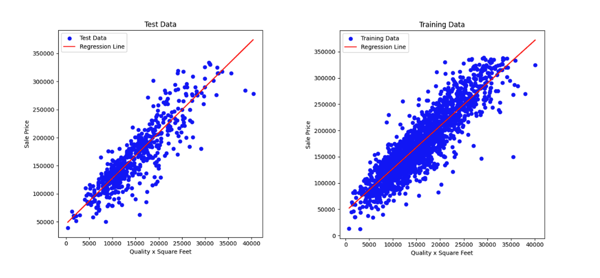

# Petabyte Pirates

## Team Members

- Sean Miller
- Farhan Hassan
- Dewayne Hafenstein

## Teams, GitHub, Google Colab

- MS TDSP

## Desired Goal(s)

- Housing market trends
- Predicting failure of Infrastructure
- Diagnostics for Healthcare
- Diagnostics for Machine Maintenance
- And a few more…

### Interests included:

- Predict the sale price of a house going up for sale

## Decided on:

### Goals

- To be able to predict the sales price of a new listing
- To be able to do “what-if” analysis by changing different features.

## Selecting the Dataset

- We examined the available datasets on
  - Kaggle
  - Data.gov
  - FiveThirtyEight
  - Zillo
  - Redfin

### Chose

- Ames Iowa Housing Sales from Kaggle
- https://www.kaggle.com/datasets/shashanknecrothapa/ames-housing-dataset

### Dataset Characteristics

- Number of Instances: 2,930
- Number of Features: 81
- Data types include both numerical and categorical values
- Record of home sales from January 2006 to July 2010

## Discovery

- Initial filtering 82 -> 13
- Number of desired features (42)
- Ratio of missing data by feature
- Correlation of features to actual sale price (picked top 13)
- Identified engineered features of interest
- Correlation of engineered features to actual sale price
- Scatter plots of all features having correlation > .50

## Features in Final Data Frame

### Retained 13 Raw Features

- MS SubClass
- Overall Quality
- Year Built
- Year Remod/Add
- Basement Finishings
- Total Basement Square Feet
- First Floor Square Feet
- Above Ground Living Area
- Number of Full Baths
- Garage Year Built
- Garage Finishings
- Garage Cars
- Garage Area

### Encoded 6 Features w/ Ordinal Mapping

- Exterior Quality
- Basement Quality
- Heating Quality
- Kitchen Quality
- Fireplace Quality
- Functional

### One-Hot Encoded 13 Features

- Neighborhood
- House Style
- Building Type
- Sale Condition
- Sale Type
- Garage Type
- Foundation
- Exterior Primary Materials
- Exterior Secondary Materials
- MS Zoning
- Lot Shape
- Lot Config
- Primary Condition

### Engineered 10 Features

- Quality x Square Feet
- Sale Date (Yr Sold + Mo Sold)
- House Age
- Remodel Age
- Age Bucket
- Total Square Feet
- Total Square Feet w/ Garage
- Total Baths
- Price per Square Feet
- Season Sold

## Analysis

## Architecture

- Front End Web Server
- Web Application
- Back End Web Server
- ML Engine
- Ames Iowa Home Sales
- Rest API
- Port 80/443
- Port 10000

## Presentation

- Form for user to input parameters to predict price of home.
- The result of each request is saved as a table below, allowing “what-if” comparisons.
- Each result of the input calculation is saved in a table.
- All columns of the table are sortable.
- This allows the user to perform what-if comparisons and to compare multiple properties.
