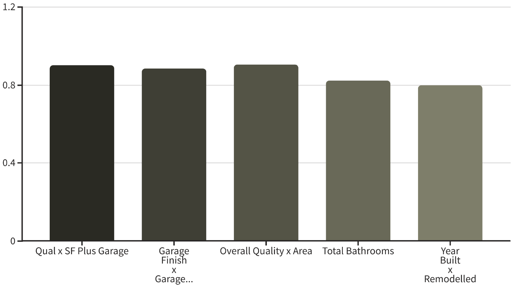
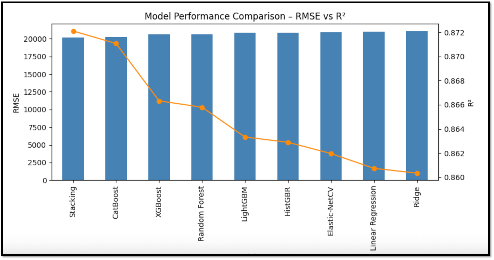

# **THE PETABYTE PIRATES**

## **Automated Property Valuation**

Transforming real estate appraisal with machine learning to deliver accurate, explainable, and consistent property valuations.

## **Team**

- Sean Miller
- Farhan Hassan
- Dewayne Hafenstein

Tools: Teams, GitHub, Google Colab, MS TDSP

## **Presentation Agenda**

1. **Data Foundation:** What data is available, where it comes from, and its relevance.
2. **Data Preparation:** How we prepare and transform data for optimal model use.
3. **Predictive Modeling:** How we predict house prices and the accuracy of our approach.
4. **Model Operationalization:** Keeping data current and integrating the tool into business practices.
5. **Evaluation & Outlook:** Pros, cons, risks, and impact of our automated valuation system.

## **Dataset Landscape: Why Ames?**

| Dataset             | Size     | Features | Sale Price   | Public  | Notes                                                                      |
| ------------------- | -------- | -------- | ------------ | ------- | -------------------------------------------------------------------------- |
| Ames Houses         | ~2,900   | 80+      | Yes          | Yes     | Clean, well-documented, ideal for feature engineering.                     |
| Zillow, Redfin Data | Millions | Limited  | Often hidden | Limited | Lacks real raw features that can be used for housing price modeling.       |
| RealEstate-Kaggle   | 2.2M     | 12       | No target    | Yes     | Sparse features, lacks a direct sale price target for supervised learning. |

The Ames dataset provides a robust foundation for our model development due to its rich feature set and readily available target variable, crucial for supervised learning. This allows for in-depth feature engineering and model validation within our project timeline.

## **Data Preparation: Key Transformations**

- **Feature Selection:** Eliminated columns with high missing values or quasi-constant distributions to reduce noise and improve model efficiency.
- **Encoding Strategy:** Applied ordinal encoding for ranked quality/condition fields and one-hot encoding for nominal categories, followed by a statistical screen to reduce dimensionality.
- **Imputation:** Utilized mean imputation within robust pipelines for numerical features and transformed categorical missing values into distinct categories, ensuring data completeness.
- **Boolean Conversion:** Converted relevant features into 0/1 boolean indicators for consistent model input, simplifying feature interpretation and model processing.

## **Success Criteria & Stakeholders**

- **$20k RMSE:** An RMSE of $20,000 means that, on average, our model's predictions will be within $20,000 of the actual sale price, a critical threshold for practical application in real estate valuation.
- **0.87 Min R²:** Min R² of 0.87 signifies that 87% of the variability in house prices can be explained by our model, demonstrating its strong explanatory power and predictive capability.
- **95% Stretch Target (Original Goal)**
- **Primary Stakeholders:** A Home Valuing Company Inc.

## **Feature Engineering Highlights**

Our most impactful feature, "Overall Quality x Overall Square Feet," significantly boosted predictive accuracy. We removed outliers to ensure robust and generalizable results.

## **Benchmarking Our Approach: Industry & Research**

- **Industry Leaders:** Zillow Zestimate and Redfin Estimate leverage sophisticated ensemble models, setting the standard for automated valuations. These platforms integrate vast datasets and complex algorithms to provide near real-time property values.
- **Academic Insights:** Research consistently shows Random Forest (RF) and Support Vector Machines (SVM) outperforming Linear Regression (LR) for property valuation, highlighting the importance of non-linear modeling techniques.
- **Our Edge: Engineered Feature Interactions:** We've engineered powerful feature interactions, such as quality multiplied by square footage, to capture non-linear relationships often missed by simpler models. This innovative approach allows us to better understand complex real estate dynamics.

## **Model Zoo & Metrics: 9 Models, One Leaderboard**

| Model         | RMSE   | R2    |
| ------------- | ------ | ----- |
| Stacking      | 20,142 | 0.872 |
| CatBoost      | 20,223 | 0.871 |
| XGBoost       | 20,592 | 0.866 |
| Random Forest | 20,632 | 0.865 |
| LightGBM      | 20,820 | 0.863 |
| HistGBR       | 20,854 | 0.862 |
| Elastic-NetCV | 20,924 | 0.861 |
| Linear Reg    | 21,017 | 0.86  |
| Ridge         | 21,047 | 0.86  |

While Stacking achieved the lowest RMSE, CatBoost presented a compelling balance of performance and deployability, making it our primary choice for this project. The top three models demonstrated minimal differences in core metrics.

## **Model Zoo & Metrics: 9 Models Graph**

## **Why CatBoost for Production?**

#### **CatBoost Advantages**

- **Near-Best Performance:** Achieved an RMSE of $20,223, closely matching the top Stacking model.
- **Simpler Deployment:** Less complex architecture translates to easier maintenance and integration into production environments.
- **Robust to Categorical:** Handles categorical features natively, reducing the need for extensive preprocessing.

#### **Stacking (Backup)**

- **Top Performer:** The highest R2 (0.872) and lowest RMSE ($20,142) demonstrate its predictive power.
- **Higher Maintenance:** Its ensemble nature adds complexity to monitoring and debugging.
- **Strategic Backup:** Reserved as a fallback if CatBoost's performance becomes insufficient for future needs.

Our decision prioritizes operational efficiency without significant compromise on accuracy, ensuring a robust and scalable solution for automated property valuation.

## **Integrating with Realtor Businesses**

Successful AVM deployment hinges on its seamless integration into the daily workflows of realtor companies. Our approach focuses on delivering value where it matters most, empowering agents with instant, accurate insights.

- **API & Platform:** for integration with existing CRMs, MLS systems, and internal platforms, ensuring valuations are available within familiar tools.
- **Enhanced Client Engagement:** Equipping realtors to provide instant property valuations, fostering trust and improving lead conversion by demonstrating data-driven expertise.
- **Customizable Market Insights:** Dashboards and reports tailored to specific market needs, enabling agents to analyze trends, generate branded reports, and inform clients effectively.
- **Training & Ongoing Support:** Comprehensive training for realtors and dedicated support channels to maximize adoption and ensure continuous optimization of the AVM's benefits.

## **Risks & Limitations**

- **Geographic Scope:** Model trained exclusively on Ames, Iowa data, limiting generalizability to diverse markets. Mitigation involves expanding training data to include varied geographies.
- **Temporal Relevance:** Based on pre-2011 market dynamics, missing shifts in recent market trends. Mitigation requires continuous data updates and re-training with current market data.
- **Prediction Intervals:** Currently provides point predictions; lacks confidence intervals for uncertainty quantification. Impact is reduced transparency for users. Mitigation is to develop methods for quantifying uncertainty.
- **Data Drift Risk:** Susceptible to performance degradation if underlying market conditions change significantly over time. Mitigation includes implementing continuous monitoring for data and concept drift, with automated model retraining triggers.

## **Our Path Forward**

#### **Mitigation & Next Steps**

1. **Macro Indicators:** Incorporate Zillow Home Value Index (HPI) and interest rates to reflect broader market conditions.
2. **Prediction Intervals:** Implement quantile regression to provide more robust predictions with associated confidence levels.
3. **Drift Monitoring:** Establish monthly RMSE-triggered alerts to detect and address model performance degradation early.
4. **Expand Dataset:** Integrate multi-city datasets to enhance model generalizability and improve accuracy across diverse regions.

These steps ensure our model remains accurate, adaptable, and a valuable asset for future property valuation needs.

## **Demonstration**

- **Frontend App:** https://acs5513-frontend-e91ce80def8f.herokuapp.com/
- **Backend Repo:** https://github.com/dewayneh57/ACS5513-Backend
- **Frontend Repo:** https://github.com/dewayneh57/ACS5513-Frontend
