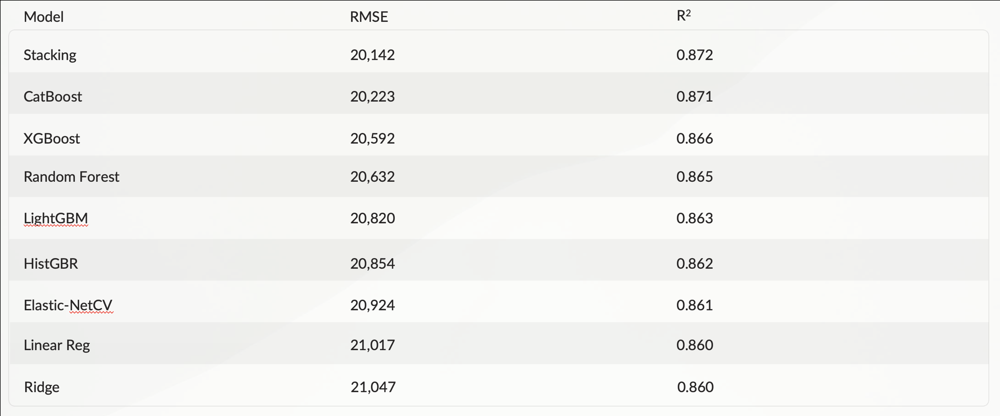
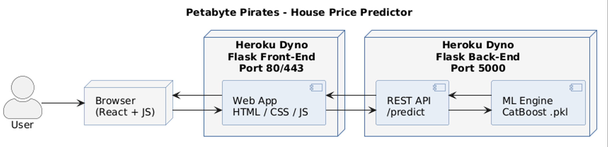
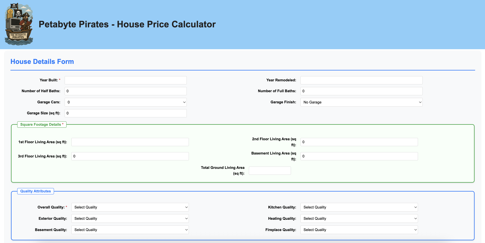
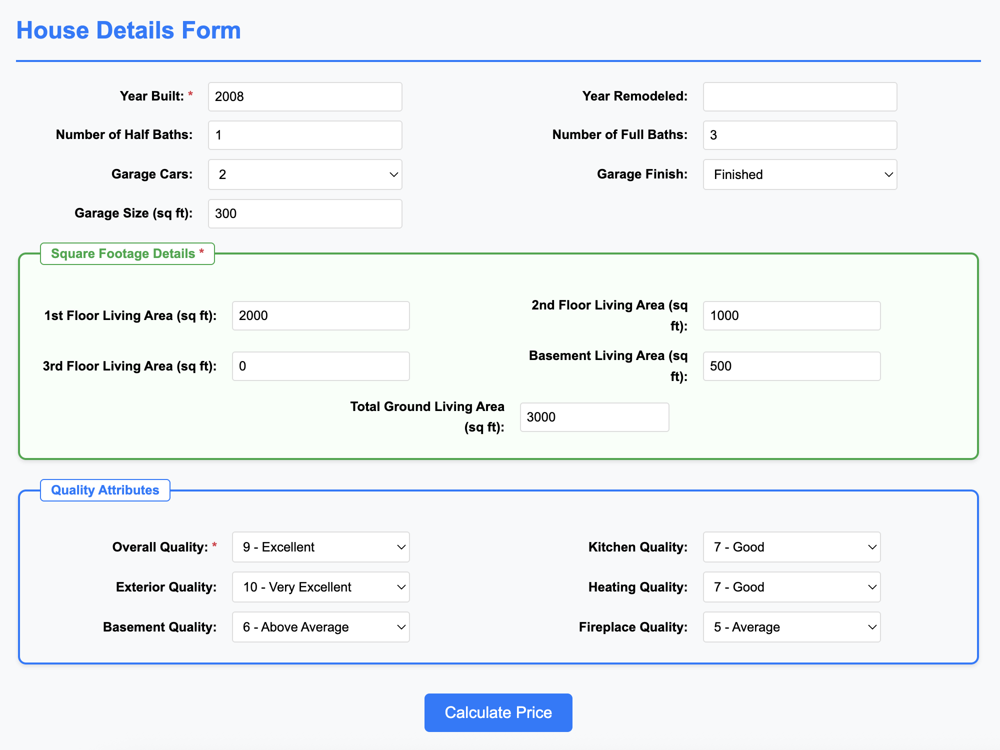
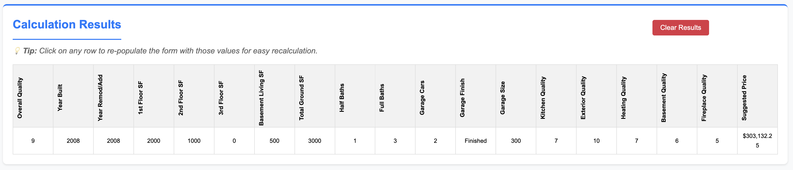

# Exit Report

**Customer**: A Home Valuing Company Inc.

**Team Members**: Sean Miller, Dewayne Hafenstein, Farhan Hassan.

## Overview

The Petabyte Pirates team delivered a **full-stack, production-ready Machine Learning (ML) service** that predicts single-family home sale prices in Ames, Iowa. The solution moves from raw CSV to live API in minutes and is designed so a business analyst-or even a curious homeowner-can obtain a data-driven estimate without touching code.

## What We Built

- **Data ingestion & feature pipeline** \- Pulls the public Ames Housing dataset from GitHub, cleans high-missing columns, imputes numeric gaps, encodes categorical variables, and engineers domain-specific interactions (e.g., _Overall Quality × Total Square Feet \+ Garage Impact_).
- **Model layer** \- Evaluates nine algorithms (tree ensembles, linear baselines, stacking). A CatBoost model, tuned by cross-validation, was chosen for deployment after landing **RMSE ≈ $ 20 k** and **R² ≈ 0.87-0.91** on unseen data.
- **Serving layer** \- A lightweight Flask API loads the serialized model (.pkl) and exposes a _/predict_ endpoint.
- **Web UI** \- A full-stack application built in flask that provides a clean form for users to enter property details and run instant “what-if” scenarios. All predictions round-trip in \<1 second.

## Why It Matters

- **Speed** \- Generates valuations in seconds vs. hours for manual comp analysis.
- **Consistency** \- Removes human bias; identical inputs always yield identical outputs.
- **Extensibility** \- Pipeline can ingest additional markets (CSV or API) with minimal code changes.
- **Transparency** \- Feature importance charts embedded in the UI help non-technical stakeholders understand key drivers.

This report walks through the business context, data journey, modeling decisions, architecture, benefits, lessons learned and recommended next steps to operationalize the service beyond a class project.

## Business Domain

**Industry:** Automated Valuation Models (AVMs) for Residential Property Technology (PropTech).

**Customer Profile**  
_A Home Valuing Company Inc._, monetizes real-estate data by selling valuation and risk-scoring software and APIs mortgage underwriters, appraisal firms and listing agents. They also provide consumer-facing software so homeowners can track their real estate over time. Their primary product returns “suggested list price” and confidence bands on demand; end-users embed these calls in loan-origination software, comparative-market-analysis tools, and homeowner dashboards.

**Market Landscape**  
The AVM space is dominated by Zillow Zestimate, Redfin Estimate and CoreLogic. Accuracy, explainability, and low latency are the three competitive levers. Regulators (e.g., Freddie Mac’s ACE+ PDR) now allow appraisal waivers if an AVM meets strict error tolerances, so a \< $20 k RMSE can translate directly into reduced closing times and fees.

**Data Environment**  
Residential data is messy. Customers expect the vendor to abstract these quirks behind consistent APIs. Therefore, a robust feature-engineering pipeline and clear data lineage are first-class requirements. Every prediction must be reproducible and traceable back to raw assessor data.

**Why Ames**  
By proving we can train and deploy a high-accuracy micro-model on the Ames market, we derisk the company’s roadmap to spin up similar models for other mid-sized metros. The project also creates a reference architecture (TDSP \+ CatBoost \+ Flask) that can be stamped out across regions with only data-layer changes.

## Business Problem

Residential property valuation today remains a **time-consuming, manually intensive** process.  Appraisers and listing agents rely on scattered MLS data, subjective comparable selection, and spreadsheet models that assume linear price drivers. The result:

- **Turn-time drag** – Full appraisals add 5-10 days and $500–$800 to transaction cost.
- **Inconsistent outcomes** – Two appraisers on the same house can differ by \>$25 k.
- **Lost deals** – Undervalued listings sit; over-valued homes require price cuts, eroding seller trust.

## Data Processing

| Property     | Value                                                     |
| ------------ | --------------------------------------------------------- |
| Raw file     | AmesHousing.csv (Kaggle ID prevek18/ames-housing-dataset) |
| Observations | 2,930 rows (2,793 after outlier removal)                  |
| Raw Columns  | 81 raw features (38 numeric, 43 categorical)              |
| Target       | SalePrice (USD)                                           |
| Date range   | 2006 – 2010 (7 months of 2010\)                           |
| Granularity  | One row per residential real-estate transaction           |

**Data Cleaning**  
Cleaning the data was a multi-step process that was grounded in traditional data science methods.

- **Outlier Removal**: Applied **1.5×IQR** rule on SalePrice; 137 extreme points (\<$3.5k and \>$339k) removed.
- **Missing Values:** Any feature with \>60% of values null were dropped.
- **Redundancy and Consistency:** Any feature with \>90% clustered to one value were dropped.
- **Ordinal Mapping:** Features with clear delineation and ranking (e.g. Poor, Average, Excellent) were converted to numerical values.
- **One-Hot Encoding:** Nominal values were one-hot encoded.

**Feature Engineering**  
Our approach followed a three-pass loop: EDA 🡪 Prototype 🡪 Validation. Every engineered feature had measurable justification before entering the model

_Pass 1 – features were hand-selected from common appraisal metrics, and were evaluated by their correlation to SalePrice, with a hard gate at |r| \> 0.5 using the pearson correlation coefficient_

- **Age Metrics:** HouseAge, RemodelAge, Age Buckets
- **Size and Quality Metrics:** Total Square Feet (comprising all individual square ft calcs), Total Baths, Imputed Number of Stories, Overall Quality x Size
- **Binary Features:** Calculating whether a feature was present or not (e.g. has basement, has fireplace)

_Pass 2 – first-order interaction features and composite blends were applied to capture non-linearity. The same correlation gate of |r| \> 0.5 was applied._

- **Qual x SF:** was initially our strongest engineered feature with a Pearson correlation coefficient of 0.89.
- **Qual x SF Plus Garage:** This feature bumped up to 0.902 correlation.
- **(Qual x SF Plus Garage) \+ (Garage Finish x Garage Area):** ended up being our strongest pre- and post-modeling feature at 0.906 Pearson correlation coefficient.

_Pass 3 – RandomForestRegressor was evaluated with all 107 shortlisted features and compared to model performance with the top-30 feature importances. The final model saw a slight reduction in R²._

| Trial                    | RMSE   | R²      |
| ------------------------ | ------ | ------- |
| All Shortlisted Features | 20,794 | 0.887   |
| Final Features           | 20,651 | 0.866   |
| Delta                    | \-143  | \-0.021 |

In totality, after exploring 81 features, we trimmed to \~30 final features with minimal impact on error, improving simplicity and runtime. Neighborhood one-hot variables collectively contributed \~1% importance and were removed to streamline the model.

## Modeling, Validation

Our modelling phase followed a “wide‑then‑focus” funnel: prototype many families quickly, score on consistent metrics, and double‑down on the top performers.

**Metric Choices**

| Metric    | Why We Chose It                                 | Stakeholder Meaning                       |
| --------- | ----------------------------------------------- | ----------------------------------------- |
| RMSE      | Penalizes large $$ errors, same units as target | “Average miss ≈ $20 k”                    |
| R²        | Proportion of variance explained                | “Model explains 87–91 % of price drivers” |
| CV RMSE σ | Stability across folds                          | “Confidence we won’t overfit”             |

**Experiment Grid**

| Family                            | Libraries                  | Key Hyper-params        | Tuned via    |
| --------------------------------- | -------------------------- | ----------------------- | ------------ |
| Linear (OLS, Ridge, ElasticNetCV) | sklearn                    | α, l1_ratio             | GridSearchCV |
| Bagging                           | RandomForest               | n_estimators, max_depth | Grid \+ OOB  |
| Boosting                          | XGBoost, LightGBM, HistGBR | learning_rate, depth    | Bayesian opt |
| Categorical Boosting              | CatBoost                   | iterations, depth       | built-in CV  |
| Stacking                          | RF \+ XGB \+ Elastic meta  | passthrough             | 5-fold CV    |

### Validation Protocol

- **Train/Test Split** – 80/20, seed \= 42\.
- **Nested 5-Fold CV** – inside GridSearch for robust hyper-parameter choice.
- **Permutation Importance** – post-fit to detect noisy features
- **Residual Diagnostics** \- Feature importance charts embedded in the UI help non-technical stakeholders understand key drivers.

**Figure 11**

Model Evaluations and Leaderboard (Ranked High to Low)

## Final Model Selection

- **CatBoost** – 80/20, seed \= 42\.
- **Latency** – Low latency on render (\<300ms).
- **Lean Model** – 0.5mb pickle files.
- **Stacking** – Retained as a power backup if backend infra supports it.

## Solution Architecture

**Figure 12**

Petabyte Pirates Software Architecture

| Layer                | Tech                             | Purpose                                           | Notes                               |
| -------------------- | -------------------------------- | ------------------------------------------------- | ----------------------------------- |
| Browser              | React \+ Vanilla JS              | Collects user inputs, displays predicted price    | Deployed to Heroku Hobby dyno       |
| Front-End Web Server | Flask (ACS5513-Frontend)         | Serves HTML/CSS and issues REST calls to back-end | Port 80/443, handles CORS           |
| Back-End Web Server  | Flask (ACS5513-Backend)          | Hosts /predict endpoint; loads CatBoost model     | Port 5000, WSGI via gunicorn        |
| ML Engine            | CatBoost pkl \+ feature pipeline | Generates price                                   | \~5 MB artifact loaded at app start |
| CI/CD                | GitHub Actions → Heroku          | Auto-deploy on push to main                       | Test suite runs \< 30 s             |

### Request Flow

1. **User submits form** at acs5513-frontend-\*.
2. JS fetch() POSTs JSON to **/api/predict** on backend (acs5513-backend-\*).
3. Backend **validates & casts** inputs → Pandas DataFrame (1 row).
4. **Feature pipeline** applies same transforms used at training.
5. **CatBoost model** returns price \+ feature_importance.
6. Response JSON streamed back; front-end renders **“Suggested Price”** row in results table.

### Design Decisions

- **Flask everywhere**: one framework to learn, tiny memory footprint.
- **Separate front/back dynos**: isolates heavy CatBoost import; UI stays responsive during model warm-up.
- **Heroku vs. Render/GCP**: free tier sunset pushed us to Hobby plan; still simplest CI path for class demo.
- **pkl on disk** vs. S3 model registry → reduces external dependencies; fine for \<20 MB model.

### User Interface

The user interface is a simple web application that allows the user to input the features of a house and get a predicted price.

The user enters common attributes of a house, such as the number of bathrooms, square footage, year it was built, etc.

Once the user has entered the features of the house, they can click the "Predict Price" button to get a predicted price. The request is sent to the backend server, which validates the inputs and casts them to a Pandas DataFrame. The feature pipeline is then applied to the DataFrame, and the CatBoost model is used to predict the price. The response is streamed back to the front-end, which renders the "Suggested Price" row in the results table.

The results table shows the features entered and the predicted price.

## Benefits

### Company Benefit

Demonstrated a reproducible ML delivery pattern from data ingestion to engineered features to APIs with UI separation that can be reused for appraisal and pricing use-cases; expanded in-house expertise in ensemble modeling MLOps patterns evidenced in this project’s architecture and model comparison work.

### Customer Benefit

Reduced appraisal error risk by moving beyond simple regressions to ensembles that capture non-linear interactions, potentially decreasing costly mispricing which can save up to $10,000+ for each house. Customer also benefits from having a lightweight UI and API that supports quick “what-if” comparisons for housing prices.

## Learnings

### Project Execution

- **Agile cadence** – regular communications and iterative development was key to on-time delivery of both Data Science and Software Engineering tasks.
- **Clear swim‑lanes** – Feature Engineering and Data Modeling (Sean), Backend / Frontend / Architecture Engineering (Dewayne), and Model Evaluation and Data Interpretation (Farhan) kept roles and responsibilities clear.
- **CI discipline** – no “works‑on‑my‑machine” surprises during Heroku deploys.

### Data science / Engineering

- **Interaction \> polynomial** – Domain‑guided combos (e.g., Qual×SF) beat brute‑force polynomial features while eliminating multi‑collinearity.
- **CatBoost resilience** – Handled 60 dummies \+ 30 numeric with minimal tuning, nearly matching stacked ensemble in RMSE.
- **Small data ≠ small compute** – 2.9k rows ballooned to 90 features; early dimensionality checks avoided “compute creep” in the final model.

### Domain

- **Quality codes trump size** – OverallQual explains \>50% variance by itself; confirms appraisal intuition that finish trumps square footage.
- **Features “Priced-In”** – intra-neighborhood variance can be explained by a combination of nominal and numerical features and doesn’t require an explicit street address to render an accurate estimate.
- **Seasonality over-hyped** \- Once quality \+ size captured, sale month added \<1% lift; price decisions outweigh listing timing for Ames.

### Product

- **Model Size Matters** – While the team originally planned on providing a feature that would allow the user to see all price predictions from all models considered, we ran into size and latency limitations that rendered that infeasible.
- **UI is Everything** – Features should be logically grouped and ordered from most to least important.
- **Form Fatigue is Real** – Users don’t want to fill out 50 different fields to get a single price prediction that’s within \+/- 3% of a prediction that can be rendered with less than half inputs
- **Python is Powerful** – Python can often be an overlooked technology for web applications in the face of Node.js.

### What's unique about this project, specific challenges

- **GarageYrBlt leakage** – NaNs on garage‑less homes excluded 159 low‑price rows; fixed with conditional impute (YearBuilt); however, not considering homes without a garage still resulted in a near-identical error profile.
- **Heroku cold‑starts** – CatBoost load (12 MB) can cause 6 second spin‑up.

### Links

- [Link to GitHub](https://github.com/dewayneh57/ACS5513)
- [Link to Web App](https://acs5513-frontend-e91ce80def8f.herokuapp.com/)
- [Link to Deliverable 1 Colab Notebook](https://colab.research.google.com/drive/10mTYa4TVJd4LEYcQDxOxoOGWro5ZIR_D#scrollTo=9PM7rTW_fxfP)
- [Link to Deliverable 2 Colab Notebook](https://colab.research.google.com/drive/1IndLhnFIcyskaO8MgSCWyfxUfZqR9HLm#scrollTo=JrYQCZoqd7yQ)
- [Link to Deliverable 3 Colab Notebook](https://colab.research.google.com/drive/1yQO1k1LBjudyjAgl6xLqTkEaf1TojZ9f?usp=sharing)

### Next Steps

- Updated data & enrichment with external signals: school ratings, interest rates/unemployment, crime/walkability, expected to further reduce residual error. **Owner**: Data Science.
- Model monitoring: continue logging prediction requests to track drift and trigger retraining on schedule (leveraging the existing request logging). **Owner**: ML Engineering.
- Deployment hardening: containerize API/UI, add autoscaling and access controls, and integrate CI/CD (aligned with the two-service architecture). **Owner**: Platform Engineering.
- Usability iterations: refine the 11-field UI, add side-by-side scenario comparison exports. **Owner**: App Team.
